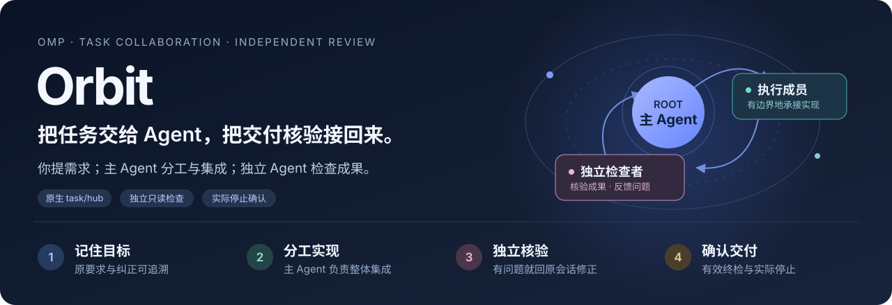
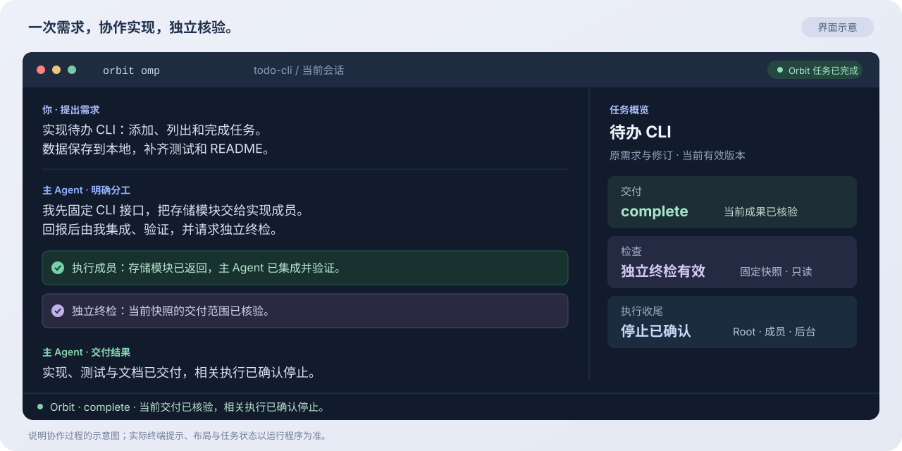

# Orbit

**给 OMP 加上任务协作与独立检查。**

你只和当前 Agent 对话。Orbit 保存目标和纠正，辅助模型分工，让独立 Agent 核对实际成果，再把问题送回原会话修正。

目标是用有限的顶级模型额度完成更多工作，减少你反复催促、转述和核对的负担。



<p align="center">
  <a href="#快速开始">快速开始</a> ·
  <a href="#使用效果">使用效果</a> ·
  <a href="#配置与模型">配置与模型</a> ·
  <a href="docs/reference/usage-reference.md">进阶使用</a>
</p>

## Orbit 能帮你做什么？

| 你关心的事 | Orbit 的作用 | 你能看到的结果 |
| --- | --- | --- |
| **长任务持续推进** | 观察受控任务；未交付且具备继续条件时提醒主 Agent 推进 | 继续执行，或明确指出缺少什么输入 |
| **多模型分工** | 为有边界的工作提供模型参考，主 Agent 派发并集成结果 | 其他模型承接实现，主 Agent 专注整体判断与交付 |
| **纠正真正落实** | 保存原要求与有效修订，后续检查对照最新要求 | 修改有来源，交付与当前需求一致 |
| **成果独立核验** | 单独的只读 Agent 检查实际产物，将具体问题交回主 Agent | 修正、复查，以及可追溯的完成与停止状态 |

适合跨文件功能开发、多步骤改造、需要核验成果的审计，以及希望用不同模型承接实现、检查和集成的任务。短小任务可以直接由主 Agent 完成。

## 使用效果



*上图为界面示意，用来说明协作与状态；文字、布局和任务内容不是实测截图。实际提示与状态以运行会话为准。*

### 一项需求怎样走到交付？


| 角色 | 职责 |
| --- | --- |
| **主 Agent（Root）** | 当前 OMP Agent，负责理解需求、实现、分工、集成和交付 |
| **执行成员** | 由主 Agent 通过 OMP 原生 `task/hub` 派发，只处理约定范围 |
| **独立检查者** | 在单独的只读 OMP 会话中，核对固定快照与当前要求 |
| **Orbit** | 保存要求、观察任务、安排检查、传递反馈并确认停止 |

你无需预先组建团队，也无需在几个 Agent 之间转述要求。分工建议由主 Agent 决定是否采纳；成员不能继续派发成员。

## 快速开始

### 1. 安装

准备 **Ruby 3.2+、Node.js 18+、npm、Bun 1.3.14+**，以及已配置可用模型的 [OMP](https://github.com/can1357/oh-my-pi) **18.2.8+**。远程安装需要 `curl` 和 `tar`。

```bash
curl -fsSL https://raw.githubusercontent.com/godokyang/orbit/main/install.sh | sh
```

安装一次，各项目共用。重新打开终端后检查：

```bash
orbit --version
orbit doctor
```

### 2. 配置并启动

建议配置 Jev，以启用自动入口判断、卡住／偏航判断与分工建议：

```bash
orbit jev setup
```

按提示输入 TypeSafe key，然后**重新打开终端**。未配置 Jev 时，任务记录与独立产物检查仍可使用。

在你的项目中启动：

```bash
cd /path/to/your/project
orbit omp
```

`orbit omp` 只为本次会话加载 Orbit。普通 `omp` 保持原样；模型、profile、权限和恢复参数沿用 OMP，例如 `orbit omp --model provider/id`。

### 3. 提需求，看结果

在会话里直接描述交付：

```text
请使用 Orbit，按 docs/requirements.md 实现功能。
完成必要验证，并给出交付结果和任务状态。
```

日常请求也可自动判定是否值得建立受控任务；明确说“请使用 Orbit”会尝试启动受控执行。显式启动失败会报告缺口；普通请求的自动启动失败则会说明本次未受 Orbit 监督。

在同一项目的另一个终端查看状态：

```bash
orbit status
```

| 状态／提示 | 表示什么 | 接下来做什么 |
| --- | --- | --- |
| **正在执行／等待检查** | 实现或检查尚未结束 | 由 Agent 继续；缺必要输入时会明确提问 |
| **可申请完成** | 当前版本具备完成申请条件 | 由主 Agent 申请完成并核对实际停止 |
| **`complete`** | 当前交付已独立核验，相关执行已确认停止 | 查看交付结果 |
| **`paused`** | 当前受控任务已暂停 | 明确保持暂停，或对同一任务追问／纠正以续接 |
| **`stop_unconfirmed`** | 尝试停止，但相关执行尚未全部确认退出 | 继续核实并收尾，不能当作已停止 |

按 Esc 会当下停止受控执行。随后追问同一任务或纠正做法时，主 Agent 先回答，再沿原要求和有效修订建立新的受控边界继续；明确暂停、先讨论、取消优先，独立问题只回答。

## 配置与模型

| 配置 | 用途 | 是否必需 |
| --- | --- | --- |
| **OMP 可用模型** | 主 Agent、执行成员和独立检查者的运行基础 | **必需** |
| **Jev / TypeSafe**：`orbit jev setup` | 入口与过程判断、任务相关分工建议 | 建议配置；未启用时不提供这些自动判断 |
| **候选模型池**：会话内 `/orbit-models` | 选择主 Agent 可用于受控分工的模型 | 可选；空池沿 OMP 可解析默认能力运行 |
| **OpenRouter 概述**：`orbit openrouter setup` | 为缺精确资料的型号补充有来源的能力基准 | 可选；不配置就不请求该目录 |

在 `/orbit-models` 中，输入文字搜索，**Space** 勾选，**Enter** 保存，**Esc** 取消。候选池跨会话保存模型标识；当前可选择不等于有额度或已经调用成功。

模型建议结合任务相关质量事实；主 Agent 也可有理由地自行选择。独立检查者优先考虑可运行的池内型号，必要时从 OMP 当前可用目录选择。目录基准不代表你的实际渠道价格或额度，混合模型协作也不保证每项任务都省钱。

配置、证据提交和检查者重选见[进阶使用参考](docs/reference/usage-reference.md#候选模型池与检查者重选adr-009)。

## 常用命令

| 命令 | 用途 |
| --- | --- |
| `orbit omp` | 启动带 Orbit 的 OMP 会话 |
| `orbit status [ID]` | 查看当前结果与下一步；多个任务时指定 ID |
| `orbit status --details` | 展开完整诊断；`--json` 用于脚本读取 |
| `orbit stop [ID]` | 请求暂停，再查看状态确认停止结果 |
| `orbit export TASK --output FILE` | 本地导出任务证据包，供排查和复核 |
| `orbit session-summary --thread ID` | 汇总当前项目同一 OMP 会话的任务与实际用量 |
| `orbit update` | 更新这份安装；已有会话继续使用启动时的版本 |
| `orbit uninstall` | 卸载这份安装，保留项目代码与任务记录 |

导出包可能含需求、代码快照和会话内容，分享前检查内容。卸载前结束使用该安装的任务与会话；仍被占用时卸载会拒绝。

## 常见问题

| 问题 | 回答 |
| --- | --- |
| 已打开的普通 OMP 能直接接入吗？ | 退出后用 `orbit omp --resume SESSION_ID` 恢复，扩展在启动时加载。 |
| Agent 没有建立 Orbit 任务？ | 先确认用 `orbit omp` 启动，再查看入口提示和 `orbit doctor`。需要受控执行时明确说“请使用 Orbit”。 |
| 没发现问题就算完成吗？ | 仍需当前版本的有效终检和实际停止确认；以最终 `complete` 状态为准。 |
| 能保证所有任务都可靠、都省额度吗？ | 本项目已有有界真实验收；效果与未测范围见[验收记录](docs/reference/long-task-optimization-acceptance-20261009.md)和[当前限制](docs/plan/debt-ledger.md)。 |

## 深入了解

| 你想了解什么 | 文档 |
| --- | --- |
| 安装选项、配置与完整 CLI | [进阶使用参考](docs/reference/usage-reference.md) |
| 当前源码、交付与安装事实 | [交接](docs/plan/handoff.md) · [源码版本](package.json) |
| 实现与真实验收证据 | [长任务优化验收](docs/reference/long-task-optimization-acceptance-20261009.md) |
| 权限、角色、检查与停止规则 | [任务运行合同](contracts/task-runtime.md) · [ADR-008](docs/adr/008-omp-native-collaboration-base.md) · [ADR-009](docs/adr/009-user-selected-model-pool.md) |
| 产品方向与其他文档 | [混合模型交付方案](docs/plan/mixed-model-delivery-proposal.md) · [文档索引](docs/README.md) |
