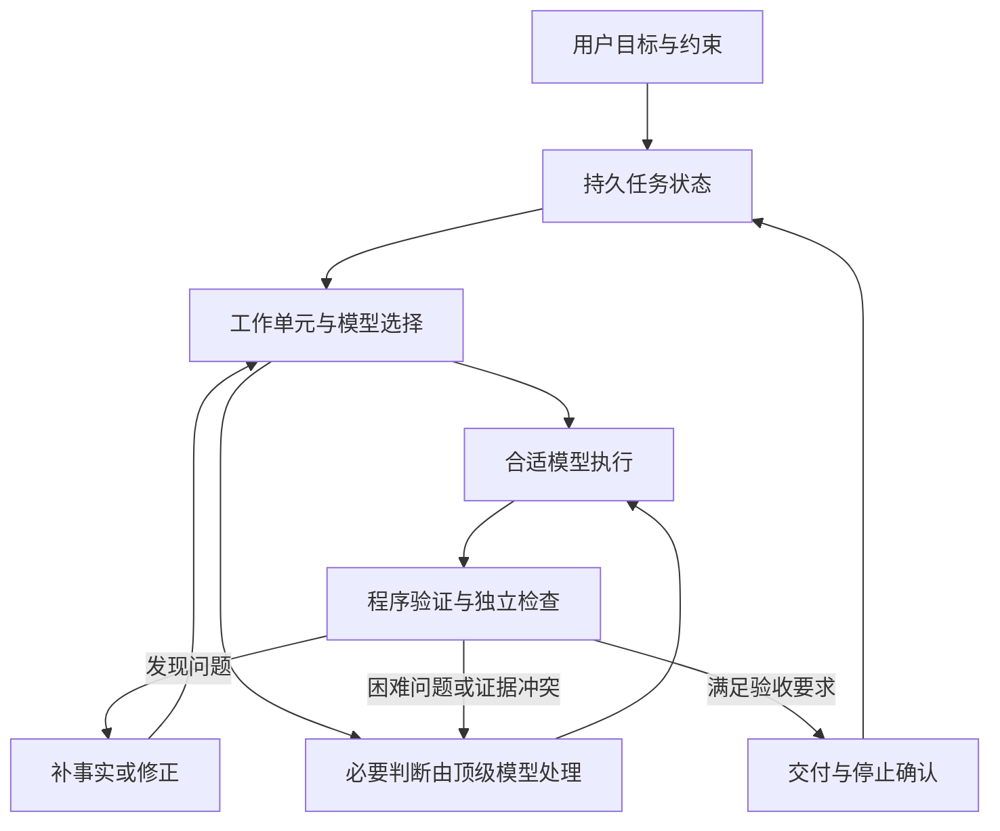

# 有限顶级模型额度下的混合交付：目标、选型与架构评估

> 状态：用户已认可的产品方向与架构评估，2026-09-29。后续实现与删除项见逐项代码审计；交付范围按本次补充一次闭合，不设分期缩减；具体架构按目标和实际接缝选定。本文不替代现行运行合同或 ADR，不表示目标行为已在 0.7.10 上线，也不改变既有独立终检的状态。
>
> 关联：[逐项代码审计](mixed-model-delivery-code-audit.md)、[现行任务运行合同](../../contracts/task-runtime.md)、[当前交接](handoff.md)。原 OpenRouter 方案的方向与六项静态审查要求已归入本文；来源审计仍保留为证据，不再维护重复方案。后续生效的行为决定需要归入对应权威正文。

## 1. 用户初衷与产品目标

顶级 GPT／Claude 模型的 token、套餐额度和现金成本是稀缺资源，用户无法无限续杯。Orbit 的初衷是通过顶级模型与其他模型配合，在尽可能保持交付质量的情况下完成更多有价值的开发工作。

所有模型仍可能幻觉、偏移、越界和遗忘。Orbit 应通过持续保存目标、约束执行、核验成果、纠正问题和必要升级，降低这些问题发生与漏出的概率，尽量减少用户监督、转述、催办和纠偏。不能承诺彻底消除模型错误。

产品目标可表述为：

> 在任务验收要求、权限边界和可接受错误风险下，用有限的顶级模型资源完成更多工作，并减少用户介入。

质量由具体用户要求、实际成果和可核验依据评价。模型数量、派发次数、Jev 分数或检查没有 finding，单独都不能代表交付成功。

### 1.1 本次已明确的方向

- 模型选型彻底移除速度、时间、本地耗时评分；不通过 tokens/s、延迟或关键路径问题变相恢复。
- OpenRouter 能力数据首先供 Jev 判断池内执行成员，也可以供独立检查者使用。
- 成本只使用可信的实际 OMP 执行路由价格、额度规则和可归属用量；未知如实保留。
- 可以重新考虑底层架构，不以保留历史设计为目的；具体实现方式依据完整目标和实际接缝选择，不为改架构而改架构。
- 本文确立目标与候选方案；运行行为改造另行实施，不能据方案描述宣称源码已具备。

定时观察、超时、凭据有效期、额度重置和停止控制仍属于运行控制或资源核算，不成为型号速度评分。

### 1.2 分别核算资源

顶级模型额度、其他模型额度和现金支出分别记录。不同模型的 token 不具有相同资源价值，订阅还可能使用请求数、加权额度或其他单位。

增加其他模型 token，同时减少顶级模型消耗、满足质量和其他资源约束，可能符合初衷。不能只以跨型号 token 总数最少为目标，也不能把每种套餐硬换成美元单价。有效工作量按同类交付要求比较，不靠拆成更多小任务增加“完成数量”。

### 1.3 本次补充：完整交付与既有自主协作

用户明确“首战就是终战”，不需要硬预算。本方案按完整目标一次交付与验收：入口、任务相关质量与真实路由成本选型、实际工作交接、错误控制、分层核验、必要升级、资源归属和最终交付停止共同闭合。实现可以按依赖顺序拆步骤，但不能以局部演示、仅展示事实或后续版本承诺代替完成。

现有 Root 已可自主调用 OMP 原生 `task/hub` 派发、通信和回收成员结果，用户不需要逐次指定或批准派发。“Root 显式派发”指 Root 发出可观测工具调用，不指要求用户手工安排。本方案保留并完善这条自主协作路径，重点接通新选型到实际派发、核验和纠偏，不能退化为只建议而等待用户操作。

自主派发在既有真实测试中已暴露问题，必须用真实任务验证 Jev 判断／推荐、Root 自主派发、成员实际登记与执行、结果回收与集成、纠偏、终检及实际停止的完整链路，不能仅凭已有工具调用能力或确定性测试判定可用。

Orbit 程序依据 Jev 分数直接发出原生派发调用，是另一种控制器实现方式，不是上述用户可见自主协作尚未存在。是否采用直接编排、专门顶级模型调用或 Root 阶段选择，应依据完整目标及宿主证据选定；现有能力不能被当作新增开关重新要求用户确认。所有实际执行仍需有原始任务授权、可核对身份和工作范围，并通过独立完成与停止门。

成本用于选择、真实消耗记录与效果比较。本次不增加现金、token 或订阅硬预算配置及其准入／停止门，成本未知不能变成额外用户确认，也不能伪称免费或已证明节省。

## 2. 对“权威能力数据 + Jev 直觉式分派”的判断

用户补充：没人能证明模型一定可靠完成任务，因此希望用权威基础能力数据，再由 Jev 结合任务作直觉式分派。本文赞同以此作为选型起点，但区分下列事实。

### 2.1 不要求给候选做可靠性认证

对于开放式任务，事前不能保证某个模型这一次一定成功。有限的本地成功样本也不能证明它在新项目、新上下文和新约束下普遍可靠。顶级模型同样没有这样的保证。

因此不应要求每个候选先提供本地任务成功证书，不应让所有型号都有本地样本成为选型前提，也不应把没有本地记录解释为不胜任。此前分析中的“质量达标候选”，更准确的目标措辞是“根据当前证据具有正向任务适配信号的候选”。实际交付仍要核验。

### 2.2 权威数据是合理先验，但不是唯一证据

权威评测提供相对一致的外部能力依据，有助于避免只凭品牌、型号名或主观印象选模。OpenRouter 在本方案中主要汇集能力数据；Artificial Analysis 等评测方提供具体指标，不能把目录条目解释为 OpenRouter 已判断此模型适合当前任务。[OpenRouter 目录 schema](https://openrouter.ai/docs/api/api-reference/models/list-all-models-and-their-properties.md)

“只能找权威数据”过于绝对：实际执行中的成功、失败、缺陷和升级也提供证据。它们应作为范围明确的运行反馈，逐步修正先验，而不是替代外部评测、建立永久品牌排名或成为逐候选启动硬门。

权威也不能免除对指标任务范围、方法版本、推理配置和测量日期的核对。Artificial Analysis 明确说明综合指数不一定直接适用于每种具体用例；其 Intelligence Index 主要针对英语文本，不能自动证明中文需求理解、视觉交付或某种检查能力。[评测方法](https://artificialanalysis.ai/methodology/intelligence-benchmarking)

### 2.3 “基础能力值 + Jev”表示组合输入，不表示数值相加

建议的目标关系是：

```text
任务要求、工作单元、实际执行配置、权威能力事实
    → Jev 的任务适配判断
    → 程序结合可信本路由资源规则形成启发式建议
    → Root 决定派发
    → 实际成果核验、修正或升级
```

基础指数不能与 Jev 概率直接相加或求平均。Jev 已经读取基准时，再把同一基准加到输出上，会重复计入同一证据。不同指数也不能当作相同量纲的成功百分比。

建议表达为“依据这些事实，当前倾向选择此候选”，保留任务、来源、局限、问题版本和判断结果；不能表达为“已证明可靠”或把一个 Noul 值宣称为当前任务实测成功率。使用 Noul 时不另造它没有返回的独立 confidence 字段。

### 2.4 校准选型机制，不证明每个模型

需要区分三件事：

| 对象 | 要回答的问题 | 能得出的结论 |
| --- | --- | --- |
| 外部能力评测 | 此型号在明确评测条件下表现如何 | 模型级先验，包含适用范围与局限 |
| Jev 选型机制评估 | 这些输入、问题和门是否产生有用选择，明显错误有哪些 | 特定任务范围内的启发式策略依据 |
| 实际交付核验 | 这次产物是否满足可核验要求 | 对应版本、对应检查范围的交付结论 |

小范围机制校准仍有价值：检验明显错配、缺证据时编造、任务变化后仍沿旧判断，以及推荐后实际失败的样本。它不要求遍历候选或证明普遍可靠，也不能变成先建设大型评测平台的前提。

原方案对未校准新题义“只展示事实、不自动正向推荐”的边界本轮不擅自废止。后续应将校准定位为问题集和选型策略的有限放行依据，而非逐型号能力认证；达到该依据后，允许明确标注的启发式建议。旧 0.55／0.50 不自动继承，放行范围外或服务失败保持事实展示与 Root 自选。

## 3. 什么时候唤起 Orbit

入口是产品主线的一部分。启动过多会浪费选型、检查和交接资源；启动过少会让值得分派或监督的任务继续由用户盯着。入口目标是识别哪些任务值得由 Orbit 接管，不能要求用户每次点名，也不能将模型基准高分直接当作启动理由。

### 3.1 区分三种“唤起”

| 层次 | 含义 | 建议触发方式 |
| --- | --- | --- |
| 会话接入 | Orbit 工具与入口钩子在会话中可用 | 保持轻量准备；打开 `orbit omp` 不自动建任务或调用检查模型 |
| 任务激活 | 建立原始要求、绑定工作区，开始受控执行与监督 | 明确受控请求，或有执行要求且具有实质分派／监督价值 |
| 任务内调用 | 请求选型判断、独立检查、纠偏或升级 | 由任务状态与相关新证据触发，不因每条消息或每个工具调用都做完整检查 |

接入、已创建受控任务、已派发成员和已开始检查分别呈现。用户需要知道这次工作是否实际受监督，不能只显示 Orbit 在场。

### 3.2 入口建议：规则优先，语义不确定时用 Jev

建议程序先处理可以确定的边界：用户明确不使用 Orbit、明确要求受控、已有任务绑定、重复消息、接入是否可用。其余需要语义判断的请求再有界调用 Jev。

明确要求“这次用 Orbit 完成某项工作”时直接尝试受控启动，不让收益分数否定用户选择；仍须通过工作区、模型可运行性、权限和已有资源约束。讨论 Orbit、引文中的命令或文件名含 Orbit 都不构成执行授权。

未点名 Orbit 时，目标入口应分别回答：

1. 用户是否要求现在执行一项具体工作，或明确交付可核验成果？
2. 当前任务是否有适合交接的实质工作，可能替代顶级模型的一部分执行消耗？
3. 当前任务是否有值得独立监督的遗漏、偏移、越界或遗忘风险？

第 2、3 项是启动价值的两条路径，不应要求同时成立：可以只有 Root 执行而需要监督，也可以有串行接力价值。混合执行的预期收益是启发式信号，未知成本不能冒充已证明节省；不以速度、耗时或“必须并行”判断入口价值。

普通直接命令本身可以提供执行授权，不要求额外出现“允许”字样。能力目录在确定需要选成员时消费，不为每条讨论提前刷新全池或评估所有型号；已可用的事实可以复用。

### 3.3 哪些任务值得启动

| 请求或情形 | 建议入口行为及理由 |
| --- | --- |
| “用 Orbit 实现登录并验证交付” | 直接尝试启动；明确受控请求 |
| 未提 Orbit 的多步功能实现、跨模块修改或完整交付 | 评估实质交接与监督价值，有据时自动启动 |
| 只有一个工作面，但验收复杂、易遗漏约束或已有反复失败 | 可以为监督和纠偏启动，不要求能派成员 |
| 一处可逆短改，程序验证清楚且风险低 | 通常普通执行；避免支付不必要的模型监督成本 |
| 只问概念、讨论选择、查询已有状态 | 通常不激活任务；不把对话本身变成受控执行 |
| 明确要求独立审计并交付检查报告 | 作为有验收要求的交付评估，不能仅因只读就判定没有价值；这是待评估的入口扩展 |
| 普通执行中发现实质依赖、范围复杂度或错误风险增加 | Root 可申请升为受控任务；核对有效原始要求与当前版本，之前动作不追认已受监督 |

这些是判断样例，不是永久的关键词或文件数量门。单行高影响修改可能值得监督，大量机械变更也可能由程序验证充分处理。

### 3.4 已有任务与后续消息

活动任务内的“继续”不应因缺少 Orbit 字样重新支付入口判定；按有效任务状态继续。明确修订仍按现行 `amend` 语义更新输入版本，独立问题不自动吞入任务，也不因新消息覆盖既有交付。

没有活动任务时，“继续”需要有可靠的原始要求归属；可以引用已授权并可追溯的上下文，但不能凭记忆猜目标或把旧任务擅自恢复。只有目标或授权真的缺失时才请求用户补充，日常入口取舍交 Root，不把每次不确定都变成用户确认。

未受控执行需要升级接管时，保存接管时的要求、产物与既有动作范围，明确从哪一刻开始监督。激活不是补写历史成功记录。

### 3.5 任务内何时调用检查与升级

优先在代表性阶段产物、成员结果、相关要求修订、修复完成、重要失败、证据冲突和最终交付节点评估下一动作。事件触发评估不等于每次都启动完整独立检查：先核对相关变化、现有有效证据和在途调用，避免重复付费。

定时观察作为补充，用于没有明显事件但需要关注的执行；等待本身不调用模型。耗时长、没有代码 diff 或普通只读操作不单独证明卡住或偏移。无新证据的重复失败、约束被违反、验收缺口或原验证不足才推动纠偏与必要升级。

最终交付仍经独立终检与实际停止确认。检查在途不再并发发相同检查，也不靠用户轮询驱动闭环。

### 3.6 当前入口事实与待调整差异

现行源码入口在未绑定任务的原生用户消息进入首次 provider 请求前判断，使用原生消息 ID 去重；明确受控请求直接尝试启动，明确不使用或讨论请求不启动。其余请求由 `orbit-entry-2` 判断 `execution_authorized` 和 `independent_check_benefit`，内置门为 0.80／0.80，不满足或服务不可用时由 Root 决定。部分 provider 不触发该钩子，不能泛称所有模型都已受控。[现行合同](../../contracts/task-runtime.md#角色与主动调用)、[ADR-008](../adr/008-omp-native-collaboration-base.md)

显式受控启动失败不能无声改成普通执行；非显式自动候选失败按现行路径明确告知“本次未受监督”，允许适用条件下普通执行。本文不改变这些语义。

现有收益问题侧重独立产物检查，并把只读请求当作无收益。本文提出将分派价值与监督价值分别判断，并按实际交付识别审计请求；这是新增题义与可能的合同差异，不能直接沿用旧版本、旧 0.80 或旧样本作为放行依据。入口分数、成员适配分与基准指数分别解释，不混用阈值。

入口评估应同时包含明确正例、低收益负例、显式拒绝、只读讨论、实际审计交付、续办归属与服务失败，观察误启、漏启、入口消耗及用户被迫提醒。无需先证明每个模型可靠，也不因某次正样本成功就宣称入口普遍正确。

## 4. 当前方案的可行性与主要缺口

目录接入、身份核对、按任务提供指标、Jev 适配判断、真实路由成本核算，在技术上具有可行路径。它们解决“根据什么选模型”，但还不能单独实现“有限顶级模型额度下多交付工作”。

主要缺口是执行结构与总消耗：如果顶级模型持续承担全部规划、文件阅读、工具循环、成员交接、集成和检查反馈，成员参与后可能只是增加了一层调用，并未替代顶级模型工作。

判断混合执行是否值得，需要核对：

```text
混合执行的顶级模型消耗
= 必要规划 + 交接 + 集成 + 复核 + 失败后升级

与顶级模型独立完成同等交付要求的消耗比较，
同时检查最终缺陷、遗漏与用户介入。
```

这是一条待验证的经济条件，不是现有节省证明。风险很高或无法有效验证的任务，直接使用顶级模型可能更合适。

## 5. 候选架构：责任连续，模型按阶段使用

本节描述服务完整目标的职责与运行结构，不表示 0.7.10 已实现。具体控制器与模型接入方式按实际接缝选定，不将必要能力推迟到下一期。

### 5.1 拆开任务责任、执行控制和具体模型

- 任务责任主体持续对原始要求、修订、集成和交付负责。
- 程序控制器保存状态、执行可计算规则、约束权限、核算资源并安排允许的步骤。
- 具体模型根据阶段所需能力承担语义判断或执行。

任务责任不随模型切换丢失。顶级模型可以用于需求歧义、复杂设计、困难诊断、低可验证性成果和争议处理；其他合适模型承担边界清楚的查证、实现、运行验证与事实整理。

不强制每项任务先调用顶级模型规划。简单且验收明确的任务可以使用已验证有效的直接执行路径。顶级模型是否常驻、是否按阶段切换或以专门调用介入，需要结合宿主能力和实际收益选择。

### 5.2 工作单元允许串行接力

可交接的工作不必可并行。顶级模型确定接口与约束，成员随后实现，再对结果复核，也可能减少顶级模型执行消耗。

每个工作单元应包含目标及对应要求、必要上下文、已确认决定、允许范围与工具、验证方式、依赖和停止／升级条件。工作单元过小会增加交接，过大则增加遗漏和偏移；按真实结果调整，不机械按文件或层次拆分。

### 5.3 运行闭环



保留 Root 自主原生派发，并将任务适配、工作单元、实际成员与结果核验接成闭环。若采用程序直接编排，明确其责任、调用范围和纠偏方式，先同步对应合同／ADR 再实现；不能借实现方式之争取消已有自主协作或增加用户逐次确认。

无新证据的重复失败应触发重新分析或升级；不能通过换名字、换模型或恢复会话重置累计消耗。仍无法闭合且需要外部信息、扩大授权或增加资源时，保留成果并说明具体需要用户提供什么。

### 5.4 宿主选择依据

OMP 可以继续作为宿主。评估它是否满足：真实模型与用量可观察、任务归属可靠、权限入口可约束、阶段模型选择可落实、成员与后台动作可控制、停止结果可确认。

出现实际能力缺口时，再比较补接缝、最小宿主修改与替换宿主的收益和代价；不为架构调整本身重写全部系统。

## 6. 对四类模型问题分别控制

| 问题 | 程序、状态与工具机制 | 模型判断的作用 |
| --- | --- | --- |
| 幻觉 | 重要事实关联来源，功能执行验证，分开观察事实与推断 | 判断证据是否支持结论，识别语义缺陷 |
| 偏移 | 工作单元绑定用户要求，阶段成果核对范围 | 判断动作是否服务目标、是否出现无关工作 |
| 越界 | 在实际工具入口限制权限、写入和外部操作，核查成果范围 | 识别权限内但任务意图外的行为 |
| 遗忘 | 持久保存要求、决定、开放问题与版本，提供相关上下文 | 判断新信息与既有目标是否冲突 |

提示约束不能替代工具层权限。任何实际限制都要核对真实写入、命令和网络入口；“指令里写了只读”不等于已落实只读。

完整聊天记录不等于可靠任务记忆。保留原始依据，提供简洁且可追溯的当前状态；推断保持推断，摘要不能成为新的用户要求。被压缩或未读取的材料须明确缺口，必要时按来源补取。

产物正确性与过程是否遵守要求分开判断，避免用同一检查证据回答不同问题。换模型家族或多个模型同意不证明统计独立，也不能靠投票替代证据。

## 7. 分层检查与覆盖记录

检查成本属于总交付成本。[现有交接](handoff.md)记录 R25 七次检查共 234855 tokens，Root／成员用量缺乏可靠任务归属；该样本提示检查成本需要关注，但不能从不同任务推出节省或无效结论。

建议按层处理：

1. 程序核对可确定事实：版本、实际身份、权限、产物存在、验证回执和停止证据。
2. 独立模型核查相关要求与当前变化中的语义问题。
3. 高风险、低可验证性、证据冲突或困难失败升级处理。
4. 最终独立检查核对整体要求覆盖与集成，保持完成和停止门。

保存“哪条要求由什么证据、在哪个版本核验”的覆盖记录。有效证据可复用；输入、相关产物或依赖变化时重新判断，不因做过局部检查就默认整项完成。

压缩检查上下文以减少重复读取，但不静默丢失约束、依赖和未核验范围。检查者仍需能读取必要原始材料和实际固定产物。低能力检查者没有 finding 不证明质量无损；需在失败样本中观察漏检与误报。

TypeSafe 的[级联示例](https://docs.typesafe.ai/cookbooks/sde_cascade.md)提供“执行、验证、升级”的参考结构，但其抽取实验不能移作 Orbit 开发任务的收益证明。

## 8. 能力事实、Jev 问题与身份分层

### 8.1 能力指标按任务提供

编码实现和相关检查使用 coding，工具工作使用相关 agentic，一般分析可用 intelligence 作为适用范围明确的先验。缺 coding 不靠 intelligence 冒充补齐；上下文、模态与工具支持是执行资格事实，不是质量分。

有匹配的权威能力事实即可构造任务适配输入，不要求先证明该候选普遍可靠。无匹配来源时显示缺口，不凭型号名评分，也不让其他候选缺证拖住有据候选。

权威先验用于初始选择，范围明确的运行反馈逐步补充。低样本量不变造成永久能力结论，不新增固定品牌排行榜。

### 8.2 Jev 问题保持具体

候选适配问题必须指向明确工作单元、交接条件和来源。执行结果出现后，可进一步判断是否缺必要输入、覆盖指定要求、得到来源支持或需要升级。

选型保留任务适配的启发式判断，不因为它不能保证未来成功而禁止所有建议；同时避免让一个宽泛问题同时承担质量认证、价格比较和权限判断。数值计算、有效期、身份核对和规则优先序由程序完成。

TypeSafe 官方列出 Jev 在复杂间接推理、数值精度、无关长上下文和对抗内容上的限制，应据此构造输入与判断边界。[Jev 已知限制](https://docs.typesafe.ai/model-jaggedness/jev-1.13.md)

### 8.3 身份分层，关系明确

建议分别保存：

- 模型与能力身份：型号版本、推理变体、基准及来源。
- 执行配置：真实端点、上下文限制、模态、工具、提示与权限。
- 计费身份：账户／计划、计价规则、单位与额度条件。
- 运行事实：实际调用身份、任务与成员归属、用量和结果。

各层通过核实的关系连接。不能自动放宽精确匹配、借相邻型号，或把真实 billing_route 改成 unknown 取数。同一模型不同路由可复用经证实的模型级先验，但执行限制和价格仍各自核对。

例如 K3 本体的目录上下文不能覆盖 `k3-256k` 路由的实际限制；模型版本可映射也不代表推理档或当前端点质量已核实。

## 9. 成本核算、预测与退化

成本包括执行、交接、选择、检查、纠正、重试与升级，不只统计成员成功的一次调用。用量需按任务、实际成员／角色和调用归属；输入、输出、缓存及推理 token 按供应商真实定义保存，避免重复计数。失败调用的缺失用量如实保留。

来源分开记录：本路由官方价格／计划规则、运行时 usage、可核实账单或额度观察。保存币种、单位、输入／输出等分类、价格有效期、适用计划与可比条件。订阅只按可核实原单位核算，不臆造 API 美元价格。

输入／输出单价互有高低且没有可信用量构成时，不能判哪一模型整项更便宜；仅有 OpenRouter 报价时，不能替代 OMP 实际价格。

建议允许范围明确的历史用量帮助预测相近工作单元：分别保留来源事实、预测范围与事后结算；样本不足保持未知，不由 Jev 编 token。预测可以帮助决策，但不能称为预算保证或实际节省，不能恢复耗时评分。

成本未知时不视为免费，也不自动否决有质量依据的建议；给出明确“成本未知”的条件性判断，不要求用户补齐每个候选的价格才能工作。本次不实现硬预算配置、预算准入或费用停止线；不承诺预算内，也不借未知数据宣称总成本更低。

顶级模型资源需要为必要核验和失败升级留下空间。保留额度的具体规则由可得用量和任务风险决定，本文不预设一个未经验证的百分比。

## 10. 原静态审查六项的处理要求

这些是后续实施需要关闭的具体缺口，不因采用启发式选择而消失。

| 项目 | 后续应明确或验证 |
| --- | --- |
| 真实路由与映射 | K3 现有映射为 unknown，成员实际路由可能为 subscription_quota；逐候选核对真实身份并建立完整关系，不伪改路由取数 |
| 成本与未知退化 | 本路由来源、币种、分类单位、订阅可比条件、成员用量归属和未知退化；交叉单价不能无用量判总成本 |
| 指标接入 | lookup 不再以 coding 非空挡住相关 agentic-only；先验保留 id 与能力限制；intelligence 扩展缓存 schema 并审计覆盖 |
| 去时间信号 | 覆盖池内、无池旧路径、检查者问题及排序、补证字段、CLI／使用说明、task_view 和历史解释；升问题版本，不沿用旧 0.55／0.50 |
| 冲突与时效 | 同时呈现目录与精确证据，核对任务、配置与版本并交 Root 复核；抓取 72 小时不是测量日期，测量未知的资格单列 |
| 新判断放行 | 用代表性真实任务、失败和缺证样本评估问题集与行为；不要求每个模型可靠性认证，未校准仍保持事实展示与 Root 自选 |

冲突不按来源名称机械决定胜负：同一模型级基准与一次路由任务失败可能都真实，但回答的问题不同。已发现的具体任务失败不能被一条目录高分静默覆盖；一次失败也不能自动宣布模型普遍无能。

## 11. 建议推进方式与效果验证

以下是同一次完整交付的实现依赖与验证次序，不是分期发布。任何必要目标未闭合时，不将当前步骤标为整项完成，也不以未校准降级长期代替新策略交付。

### 11.1 先接通有依据的入口与选择

分别评估入口的分派／监督价值问题与候选任务适配问题，补真实身份和相关指标，版本化题义，删除所有选型时间信号，明确未知和建议归因。对机制做小范围校准，支持权威先验驱动建议，不以全池本地样本为前置。保持 Root 决策与现行独立完成门。

### 11.2 同时闭合交付与资源证据

补调用归属和原单位核算，定义可交接工作单元，保留要求、事实、修订和开放问题。对已有闭环复用有效验证，不为每次文案变化重开全量验收。

### 11.3 在同次交付中验证架构收益

验证串行接力、分层检查、顶级模型按需介入。某条路径增加了交接、检查和升级消耗，或留下更多重要缺陷时，调整或停用该路径，不为证明混合执行有益强行推广。Root 自主派发已是现有能力，应保留并完善。程序直接编排、Root 阶段选模或宿主调整按实现证据选择，涉及运行语义时同步合同／ADR；不能将这些实现选择变成延后关键目标或让用户逐次派发的理由。

### 11.4 衡量有效交付，不衡量推荐次数

比较同类、同等验收要求下的顶级模型独立执行、当前 Orbit 与候选混合方案。记录有效工作量、遗漏及缺陷严重度、顶级模型实际消耗、其他资源消耗、升级／返工负担、用户介入以及四类错误的发现和漏出。

外部评估依据保持一致，不只使用待评估系统自己的“通过”作为标签。任务、判断和结果需要可追溯；调问题／阈值的样本与评价效果的样本分开。研究校准投入和日常运行成本分别报告，不混入日常节省结论。

有限样本只能说明适用范围内的表现，不证明普遍可靠。确定性测试验证接线和约束，动态目录数据做一次性审计，真实任务评价模型与闭环表现；不为了覆盖率扩大测试或固化实时基准数字。

## 12. 0.7.10 状态与未完成事项

截至本轮读取，[当前交接](handoff.md)与[映射来源审计](../reference/openrouter-model-mapping-audit.md)记载的是源码和来源核对状态，不能等同于已发布或安装版目标行为验收。

| 状态 | 内容 |
| --- | --- |
| 源码已有 | 可选 OpenRouter setup、0600 私有凭据与快照、72 小时目录缓存、四条经审计映射、检查者弱质量先验／降级、独立检查安全门 |
| 旧成员行为仍在 | `jev-candidates-1` 质量 0.55 与时间 0.50 双门；粗档费用排序 |
| 新方向未完成 | 成员 OpenRouter Jev 接线、去时间门、本路由 token 成本数据流、新题义校准与验收 |
| 本文目标及实现选择 | 分派／监督价值入口、审计交付入口扩展、串行接力、分层核验与覆盖记录、必要顶级模型介入和资源观察须在同次交付中闭合；程序直接编排、Root 阶段选模与宿主调整是实现选择，不表示已实现 |

本文保存用户认可目标与本次补充范围。实现时先把具体运行语义同步对应合同／ADR，再完成实现与真实验收；不能把本文目标提前写成现行能力。既有独立终检的状态仍以运行记录为准。
